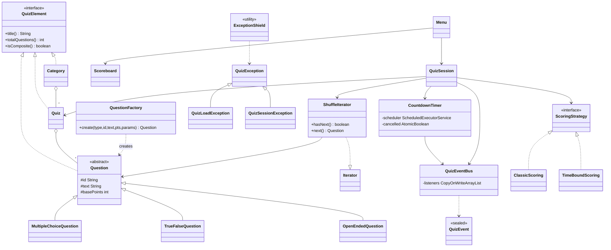
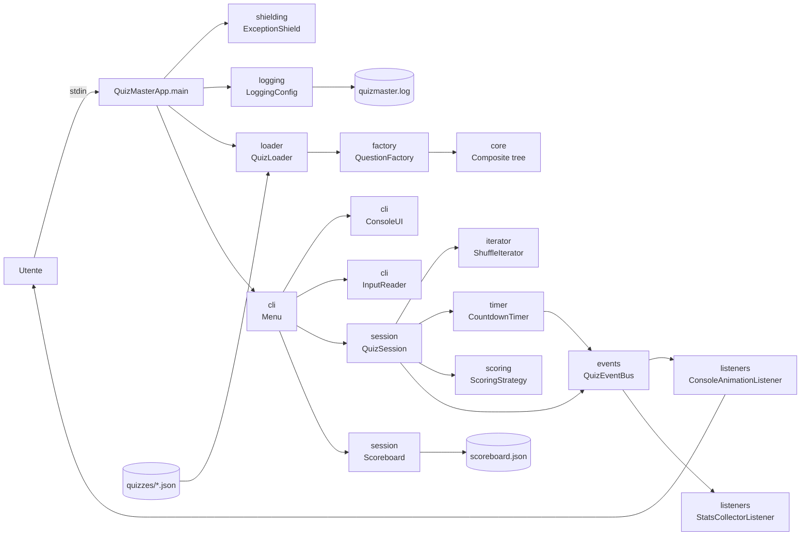

# QuizMaster

Un quiz interattivo da riga di comando, scritto in **Java 21**. Scegli una categoria (Storia, Geografia, Cinema, Informatica), rispondi alle domande contro un timer, e vedi il tuo punteggio sulla classifica locale.

## 1. Overview

QuizMaster è un'applicazione CLI menu-driven (niente GUI, niente web): apri il terminale, lanci il jar, ti appare un menu numerato, scegli che fare digitando 1/2/3/q. Il quiz vero e proprio chiede una domanda alla volta, avvia un timer di 15 secondi su un thread di background, e calcola il punteggio in base alla strategia che hai scelto (classica oppure "a tempo" che premia la velocità).

I quiz vivono in file JSON nella cartella `quizzes/`: aggiungerne uno nuovo significa solo droppare un nuovo file lì dentro — il programma lo carica al volo all'avvio. La classifica è persistita su `scoreboard.json` e mantiene la top-10 cross-session.

## 2. Quick start

### Prerequisiti

È richiesto **Java 21** (o superiore). Maven è opzionale: il progetto include il Maven wrapper (`mvnw` / `mvnw.cmd`).

| Sistema | Installazione Java 21 |
|---|---|
| **macOS** | `brew install openjdk@21` |
| **Windows** | [Adoptium / Temurin 21](https://adoptium.net/temurin/releases/?version=21) (installer .msi) |
| **Linux (Debian/Ubuntu)** | `sudo apt install openjdk-21-jdk` |

### Build + esecuzione (macOS / Linux)

```bash
./mvnw clean package
java -jar target/quizmaster.jar
```

### Build + esecuzione (Windows)

```cmd
mvnw.cmd clean package
java -jar target\quizmaster.jar
```

### Comandi utili (tutti i sistemi)

```bash
# Mostra help
java -jar target/quizmaster.jar --help

# Usa un'altra cartella di quiz
java -jar target/quizmaster.jar /percorso/altra-cartella

# Disabilita i colori ANSI (utile in CI o terminali datati)
NO_COLOR=1 java -jar target/quizmaster.jar     # macOS / Linux
set NO_COLOR=1 && java -jar target\quizmaster.jar     # Windows
```

Output runtime (creati nella working directory): `quizmaster.log.0` (log dettagliato FINE, rotato a 1 MiB × 3 file), `scoreboard.json` (classifica top-10 persistente).

## 3. Architecture

```
       ┌──────────────────┐
       │ QuizMasterApp.main│
       └────────┬─────────┘
                │
       ┌────────▼─────────┐
       │ ExceptionShield  │  ◄── boundary unico per le eccezioni
       └────────┬─────────┘
                │
   ┌────────────┼─────────────────────────────────┐
   ▼            ▼                                 ▼
┌──────────┐  ┌──────────┐  ┌──────────────────┐
│ Logging  │  │QuizLoader│  │  Menu (TUI)      │
│  Config  │  │ (JSON)   │  │                  │
└──────────┘  └──┬───────┘  └────────┬─────────┘
                 │ uses              │
                 ▼                   ▼
            QuestionFactory     QuizSession ──► ShuffleIterator (Iterator)
                                    │       ──► CountdownTimer (Multithread)
                                    │       ──► ScoringStrategy (Strategy)
                                    ▼
                            QuizEventBus (Observer)
                              │       │
                              ▼       ▼
                  ConsoleAnimation   StatsCollector
                       listener        listener
```

Ogni operazione "rischiosa" (lettura file, esecuzione sessione) passa da `ExceptionShield.run(...)` così le eccezioni interne non arrivano mai all'utente come stack trace.

## 4. UML class diagram

Versione Mermaid (renderizza nativamente su GitHub). La versione PlantUML è in [`docs/class-diagram.puml`](docs/class-diagram.puml); generare il PNG con `plantuml docs/class-diagram.puml`.



## 5. UML architectural diagram

Vista a package; PlantUML in [`docs/architecture-diagram.puml`](docs/architecture-diagram.puml).



## 6. Design patterns utilizzati

I quattro pattern strutturali e comportamentali principali sono implementati lungo il percorso critico dell'applicazione: senza di essi il programma non funziona.

### 6.1 Composite

- **Cosa**: un quiz è un albero. `QuizElement` è l'interfaccia uniforme, `Question` la foglia, `Quiz` e `Category` i compositi. Tre livelli annidati.
- **Dove**: [`core/QuizElement.java`](src/main/java/com/andreapirazzini/quizmaster/core/QuizElement.java), [`Question.java`](src/main/java/com/andreapirazzini/quizmaster/core/Question.java), [`Quiz.java`](src/main/java/com/andreapirazzini/quizmaster/core/Quiz.java), [`Category.java`](src/main/java/com/andreapirazzini/quizmaster/core/Category.java).
- **Perché**: la metodologia `totalQuestions()` si propaga ricorsivamente, e tutti i livelli si trattano allo stesso modo.

### 6.2 Factory

- **Cosa**: il tipo della domanda è una stringa nel JSON. La factory mappa quella stringa alla classe concreta giusta.
- **Dove**: [`factory/QuestionFactory.java`](src/main/java/com/andreapirazzini/quizmaster/factory/QuestionFactory.java).
- **Perché**: il loader non sa nulla delle sottoclassi di `Question`, e chiunque voglia aggiungere un nuovo tipo (es. "matching") tocca solo questo file.

### 6.3 Iterator

- **Cosa**: implementazione vera di `java.util.Iterator<Question>` che presenta le domande in ordine casuale ma riproducibile (Fisher-Yates con seed).
- **Dove**: [`iterator/ShuffleIterator.java`](src/main/java/com/andreapirazzini/quizmaster/iterator/ShuffleIterator.java).
- **Perché**: l'iterator non solo presenta una domanda alla volta, ma con seed deterministico permette di "rigiocare la stessa partita" — utile per i test.

### 6.4 Exception Shielding

- **Cosa**: un boundary unico che cattura ogni eccezione interna, scrive lo stack trace nel log file, e rilancia una `QuizException` sanitizzata.
- **Dove**: [`shielding/ExceptionShield.java`](src/main/java/com/andreapirazzini/quizmaster/shielding/ExceptionShield.java).
- **Perché**: impedisce che dettagli implementativi (path di file, stack trace, messaggi di sistema) raggiungano l'utente. Una sola classe risolve sia il problema dei leak che quello dei messaggi non sanitizzati.

### 6.5 Strategy

- **Cosa**: scegliere a runtime come si calcolano i punti. `ClassicScoring` = punteggio binario, `TimeBoundScoring` = punti = base + secondi rimasti.
- **Dove**: [`scoring/ScoringStrategy.java`](src/main/java/com/andreapirazzini/quizmaster/scoring/ScoringStrategy.java) e le due implementazioni nella stessa cartella.

### 6.6 Observer

- **Cosa**: il `QuizEventBus` pubblica eventi (`QuizStarted`, `QuestionPresented`, `AnswerGiven`, `QuestionScored`, `QuizCompleted`, `TimerTick`, `TimerExpired`) verso `QuizEventListener` registrati.
- **Dove**: [`events/`](src/main/java/com/andreapirazzini/quizmaster/events/). Backed da `CopyOnWriteArrayList` perché il timer (thread di background) pubblica eventi concorrentemente al main thread.

### 6.7 Multithreading

- **Cosa**: `CountdownTimer` gira su un thread daemon, pubblica `TimerTick` ogni secondo, e `TimerExpired` allo scadere. `cancel()` race-free via `AtomicBoolean`. Thread pool chiuso in `finally` per evitare leak.
- **Dove**: [`timer/CountdownTimer.java`](src/main/java/com/andreapirazzini/quizmaster/timer/CountdownTimer.java).
- **Nota**: l'unità di parallelismo è il timer di una domanda — main thread legge input, background thread fa countdown. Sincronizzazione tutta via Atomic, niente lock espliciti.

## 7. Tecnologie utilizzate

- **Java SE Collections**: `Map<String, BuildTarget>` (registry implicito nei loader), `Set<String>` (token V/F nei TrueFalse), `Deque` (ready queue iterator), `List<Question>` (composite), `ConcurrentHashMap` / `CopyOnWriteArrayList` (event bus thread-safe), `AtomicBoolean`/`AtomicInteger` (timer).
- **Generics**: `QuestionResult<T>` generica per il payload tipato.
- **Java I/O**: `Files.readString` / `BufferedWriter` in `SafeFileReader` / `SafeFileWriter`, try-with-resources sempre.
- **Logging**: `java.util.logging` con `logging.properties`; due-tier ConsoleHandler INFO + FileHandler FINE rotato.
- **Stream/Lambda**: `Scoreboard.totalScoreByQuiz()` (`groupingBy` + `summingInt`), `Category.totalQuestions()` (mapToInt + sum), `OpenEndedQuestion.isCorrect()` (stream + anyMatch).
- **JUnit 5 + Mockito**: 49 test, 11 classi di test, ogni pattern principale ha la sua classe dedicata.

## 8. Modello di sicurezza

QuizMaster applica sei regole di robustezza implementate sistematicamente in codice:

| Regola | Implementazione |
|---|---|
| Nessuno stack trace visibile all'utente | `QuizMasterApp.main` cattura solo `QuizException` e stampa `getMessage()`. `ExceptionShield` logga lo stack trace SOLO al FileHandler. |
| Nessun crash su input invalido | Ogni entry point passa da `ExceptionShield.run`. JSON malformato → `QuizLoadException` sanitizzata. |
| Nessuna credenziale hardcoded | QuizMaster non si collega a nessuna API o database. |
| Sanitizzazione degli input | `InputSanitizer.sanitize` strippa control characters e limita a 256 char. |
| Nessun leak di eccezioni | `QuizException` è l'unica eccezione pubblica; `IOException` / `RuntimeException` sono wrappate al boundary. |
| Logging strutturato | Two-tier: Console INFO terso, File FINE dettagliato. `System.out` solo nei file consentiti. |

Check rapidi dal terminale:

```bash
grep -r "printStackTrace" src/         # vuoto (solo nei commenti Javadoc)
grep -rn "System.out"     src/main/    # solo i 3 file consentiti
```

## 9. Limitazioni note

1. **Niente quiz a tempo "vero".** Il timer è per-domanda, non per partita. Per un timer di sessione complessivo ci vorrebbe un'altra strategia di multithreading.
2. **InputReader con timeout ha un trade-off.** Se l'utente non risponde a una domanda, il thread di lettura rimane bloccato in `readLine()`; il prossimo INVIO viene "consumato" dalla domanda successiva. Soluzione corretta richiederebbe NIO non-blocking.
3. **Niente quiz multi-utente / sessioni concorrenti.** Una sola partita per JVM.
4. **Scoreboard locale.** Non c'è un server centrale, solo `scoreboard.json` nella working directory.
5. **JSON schema non validato formalmente.** Niente JSON Schema — il loader fa validazione "a campi", che basta per i 4 file di esempio ma non per un'integrazione con terze parti.

## 10. Lavori futuri

1. **Plugin SPI**: nuovi tipi di domanda registrati via `ServiceLoader` con file `META-INF/services`.
2. **Modalità multiplayer**: 2 giocatori sullo stesso terminale, alternati, con classifica condivisa.
3. **Statistiche avanzate**: tempo medio di risposta per categoria, accuratezza per tipo di domanda, "domande più sbagliate".
4. **Online leaderboard**: sync di `scoreboard.json` con un endpoint REST tramite `HttpClient` di Java 21.
5. **Editor dei quiz**: comando `quizmaster --edit storia` per modificare i JSON da CLI invece che a mano.

---

Autore: **Andrea Pirazzini**.
